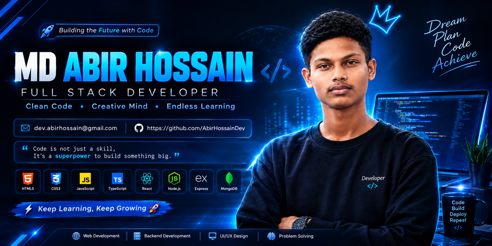
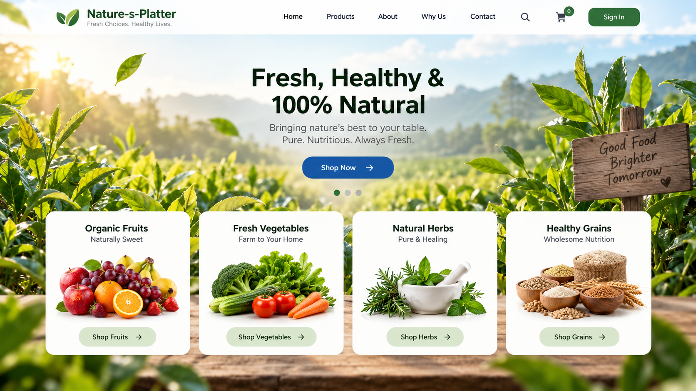

<!-- 🌈 PREMIUM ANIMATED HEADER -->

 

<!-- 💓 WELCOME -->

  

 

<!-- ⚡ DEVELOPER ROLES -->

  

 

<!-- 🌈 COLORFUL LINE -->

  

 
 

  

 

<h1 align="center">
  👋 Hi, I'm MD Abir Hossain
</h1>

  

<h2> 🔭 I build things with JavaScript, React, and Node.js</h2>

 

---

# 👨‍💻 About Me

<table>
<tr>

<td width="55%" valign="top">

I'm a passionate full-stack developer who enjoys building modern,
high-performance web applications.

I love working with JavaScript, **React, and **Node.js, and I'm
always exploring new tools and technologies to improve my workflow.

Currently, I'm focused on expanding my knowledge in GraphQL and
Docker while working on exciting real-world projects.

### 🚀 What I Love

- 💻 Web Development
- ⚛️ React Development
- 🟢 Node.js
- 🧠 Problem Solving
- 🔧 Building Real-World Projects
- 📚 Continuous Learning

</td>

<td width="45%" align="center">

  

</td>

</tr>
</table>

---

# 🛠️ Tech Stack

### 🎨 Frontend

  

### ⚡ Backend

  

### 🔧 Tools

---

<!-- ===================== GITHUB STATS ===================== -->

<!-- ===================== GITHUB STATS ===================== -->

<!-- ===================== GITHUB STATS ===================== -->

## 📊 GitHub Stats

<table>
<tr>

<td width="50%" align="center">

### 📈 GitHub Stats

</td>

<td width="50%" align="center">

### 💻 Most Used Languages

</td>

</tr>
</table>

 

# 🔥 GitHub Streak

<!-- ===================== 3D CONTRIBUTION ===================== -->

---

# 📋 GitHub Profile Summary

# 🧊 3D GitHub Contribution

### 🌈 Night Rainbow

  

---

### 🐍 Contribution Snake

# 🚀 Featured Project

<table>
<tr>

<td width="50%" align="center">

## 🌿 Nature-s-Platter

</td>

<td width="50%" valign="middle">

### 🍃 Nature-s-Platter

A modern and responsive website focused on fresh, healthy, and natural products.

### 🛠️ Built With

  

</td>

</tr>
</table>

---

---

# 🚀 Currently Learning

  

💡 Learning new technologies  
🔥 Building real-world projects  
📚 Improving problem-solving skills  
🚀 Becoming a better Full-Stack Developer

---

# 🎯 2026 Developer Goals

| 🎯 Goal | 🚀 Progress |
|--------|-------------|
| Master TypeScript | 🔥 Learning |
| Learn Next.js | 🚀 In Progress |
| Learn GraphQL | 📚 Learning |
| Improve Backend Skills | 💪 Working |
| Build More Real-World Projects | 🚀 Active |
| Contribute to Open Source | 🌟 Coming Soon |

# 🤝 Let's Connect

### 🚀 Let's Build Something Awesome Together

 

---

## 💡

### “Code is like humor. When you have to explain it, it's bad.”

— Cory House

 

  

### ⭐ Thanks for visiting! ⭐

Built with ❤️ by Dev. Abir

